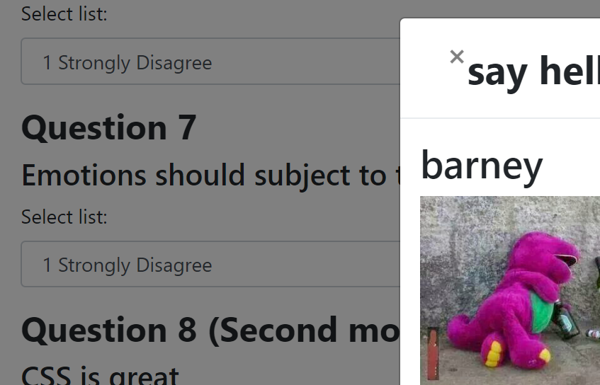

# Title: Friendfinder
### Contributor:       Eddie Rodriguez
### GitHub URL:        https://github.com/erodriguez87/friendfinder
### Heroku URL:        https://findnicepeople.herokuapp.com/
### Video Example Customer View: https://youtu.be/aZSgXhHLNB8
### Video Example Manager View: https://youtu.be/DfHDKznm3zk

This is an application published through heroku with an express server and a couple of HTML pages. The app handles a series of questions for each user and matches the results with the database to find friends that have similar scores.

The application uses bootstrap 4.0 to handle the basic styling and the input groups. The values from the survey are passed back to a post route that adds the new person to an object. 

The new person is compared to everyone in a javascript variable and 

### Packages included

   * [Express](https://www.npmjs.com/package/express)
   * [Body-Parser](https://www.npmjs.com/package/express)

* Check out [this demo version of the site](https://friend-finder-fsf.herokuapp.com/). Use this as a model for how we expect your assignment look and operate.
